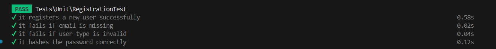

<br><br>

<!-- project philosophy -->


> A mobile app that translates sign language into speech, making communication easier for sign language users.
>
> SignSpeak aims to bridge the communication gap by providing a user-friendly platform that translates sign language into spoken words in real-time. We believe in enhancing accessibility and ensuring effective communication.

### User Stories

#### For Regular Users
- As a regular user, I want to sign into the app, so I can start translating my signs into speech.
- As a regular user, I want to upload videos and images for translation, so I can get speech output from my saved content.
- As a regular user, I want to use real-time translation with my camera, so I can see immediate speech output from my sign language.

#### For Mute Users
- As a mute user, I want to sign into the app, so I can start translating my signs into speech.
- As a mute user, I want to use the app for real-time translation with my camera, so I can see immediate speech output from my sign language.
- As a mute user, I want to access a history of my translations, so I can review and refer back to previous translations.

<br><br>

<!-- Tech stack -->


### SignSpeak is built using the following technologies:

- **Backend**: Powered by Laravel, a PHP framework used for handling API requests, database management, and secure user authentication with JWT.
- **Frontend**: Developed using Flutter, a cross-platform framework that delivers a consistent user experience across mobile, web, and desktop.
- **Machine Learning**: Python is utilized to power the machine learning models for real-time sign language translation. It processes data received from images, videos, and live camera feeds.
- **Real-Time Translation**: Enabled using FastAPI, which provides WebSocket connections for efficient communication and real-time interaction.
- **Database**: MySQL is used to store and manage user data and translation records.
- **Text-to-Speech**: Eleven Labs is integrated to convert the translated text into speech, offering a smooth user experience for hearing users.
- **Design**: The app follows Material Design principles for a clean, intuitive interface.
- **ASGI Server**: Runs using Uvicorn, ensuring fast and scalable Python backend performance.
- **Hand Landmark Detection**: The project uses MediaPipe for detecting and processing hand landmarks, a critical feature for recognizing sign language gestures.
- **AI Model**: Trained to recognize both hand's  movements, supporting accurate American Sign Language (ASL) interpretation from live video streams.
- **Data Security**: All sensitive user data is securely managed and protected using JWT-based authentication mechanisms in Laravel.

  
<br><br>
<!-- UI UX -->


> We designed SignSpeak using wireframes and mockups, iterating on the design until we reached the ideal layout for easy navigation and a seamless user experience.
- Project Figma design [figma](https://www.figma.com/design/jce22W4lDvg7z5WlfgySeo/SignSpeak?node-id=0-1&node-type=canvas&t=CekBLhJ0QhEw6czf-0)
<br><br>

<!-- Database Design -->


###  Architecting Data Excellence: Innovative Database Design Strategies:

- Insert ER Diagram here


<br><br>


<!-- Implementation -->


### User Screens (Mobile)
| Login screen  | Register screen |Profile Screen |
| ---| ---| ---|
|  |  |  |
| Uploaded Media Screen  | Live Transaltion screen | History Screen |
|  |  |  |

<br><br>


<!-- Prompt Engineering -->


###  Mastering AI Interaction: Unveiling the Power of Prompt Engineering:

- This project harnesses cutting-edge AI and machine learning technologies to bridge the communication gap between sign language users and the broader community. By integrating a sophisticated AI model trained to recognize American Sign Language (ASL) gestures, the app provides real-time translation from sign language to both speech and text. The app uses Eleven Labs to convert translated text from the model into high-quality speech, ensuring an engaging and natural auditory experience. It features live video translation, and the ability to upload videos or images for translation. Machine learning models analyze hand movements for accurate gesture recognition, and data visualization tools offer insights into user performance and engagement. These innovations create a personalized and inclusive communication experience, enhancing accessibility and interaction for both regular and mute users.

#### Real-Time Sign Language Translation with WebSocket


#### AI-Powered Sign Language Translation via Image and Video Uploads


#### Speech Generation using Eleven Labs API

This Laravel controller handles text-to-speech conversion using the Eleven Labs API. It generates speech based on the text input provided in the request and returns an audio file in MPEG format.


<br><br>

<!-- AWS Deployment -->


###  Efficient AI Deployment: Unleashing the Potential with AWS Integration:

- This project leverages AWS deployment strategies to seamlessly integrate and deploy natural language processing models. With a focus on scalability, reliability, and performance, we ensure that AI applications powered by these models deliver robust and responsive solutions for diverse use cases.

<br><br>

<!-- Unit Testing -->


###  Precision in Development: Harnessing the Power of Unit Testing:

- This project employs rigorous unit testing methodologies to ensure the reliability and accuracy of code components. By systematically evaluating individual units of the software, we guarantee a robust foundation, identifying and addressing potential issues early in the development process.




<br><br>


<!-- How to run -->


> To set up SignSpeak locally, follow these steps:

### Prerequisites

Ensure that you have the following installed on your machine:
- **Flutter**: [Install Flutter](https://flutter.dev/docs/get-started/install)
- **Laravel**: [Install Laravel](https://laravel.com/docs/installation)
- **Python**: [Download Python](https://www.python.org/downloads/)
- **Uvicorn**: For running the Python server (installed via pip)

### Installation

#### 1. Clone the repository
   ```bash
   git clone https://github.com/AliAljawad/SignSpeak.git
   cd sign-speak
   ```
#### 2. Flutter Frontend Setup
  - Open your Android emulator.
  - Navigate to the Flutter project directory.
  - Create a `.env` file in the root of your Flutter project and add the following line:
  ```plaintext
  BASE_URL=http://10.0.2.2:8000
  ```
  - Run the following commands:
   ```bash
      flutter pub get
      flutter run
   ```
   This will start the Flutter frontend on your emulator.
#### 3. Laravel Backend Setup
- Navigate to the Flutter project directory.
- Create a `.env` file in the root of your Laravel project and add the following lines:
  ```plaintext
  DB_DATABASE=signspeak
  APP_URL=http://10.0.2.2:8000/
  ELEVEN_LABS_API_KEY='your eleven lab api key'
  ELEVEN_LABS_VOICE_ID='your voice id'
  ```
- Run the following command to serve the backend:
```bash
   php artisan serve
   ```
#### 4. Python Model and WebSocket Setup
- Navigate to the Python model directory:
```bash
   cd SignDetectionModel
   ```
- Install the required dependencies:
```bash
   pip install -r requirements.txt
   ```
- To start the WebSocket server for real-time translation, run:
```bash
   python ./webSocket_classifier.py
```
- To start the server that handles uploaded images and videos, run:
```bash
   python -m uvicorn uploaded_files_classifier:app --reload --host 0.0.0.0 --port 8001
```

Now you should be able to run the SignSpeak app locally, with real-time translation and video/image upload features.
